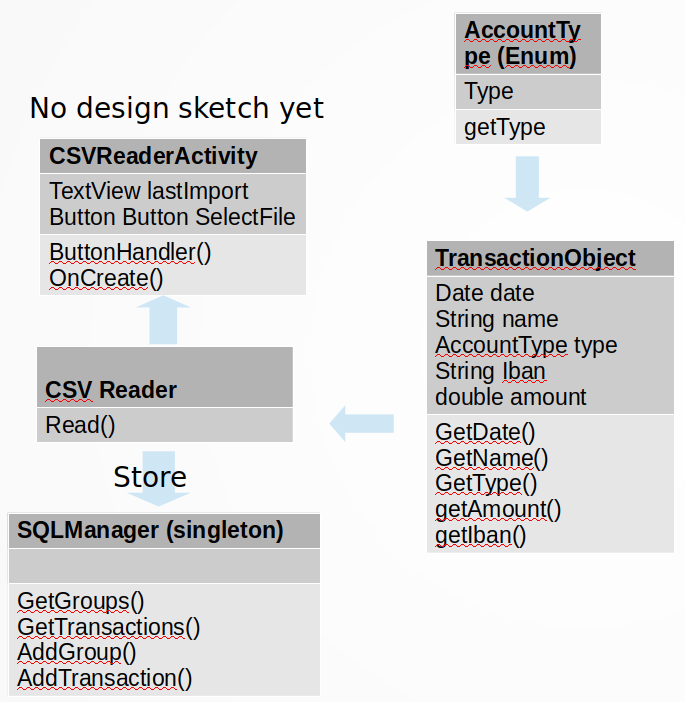

# Design Document

## External Data Sources

### ING APi

The ING API returns a JSON file with all the transactions. I'm not sure yet if it is possible for consumers to connect to the API. That's why I've also considered the following option

### Import CSV File

If it is not possible to connect to the ING API, I'll let the user download a csv file from their online banking and select the file manually in the app. Instead of receiving an online JSON file, the app will read a offline file.
Every line is a new transaction. I'll need to read every transaction and check if the transaction is already in the database. If not, store it. I don't need to filter any data besides checking if it's already there.
 
## Advanced sketches of UI

I could'nt fit all the activities in one sketch so I've added a sketch for every activity

### Main Activity

### Transaction overview

### process Transaction

### manage categories

### Read CSV

