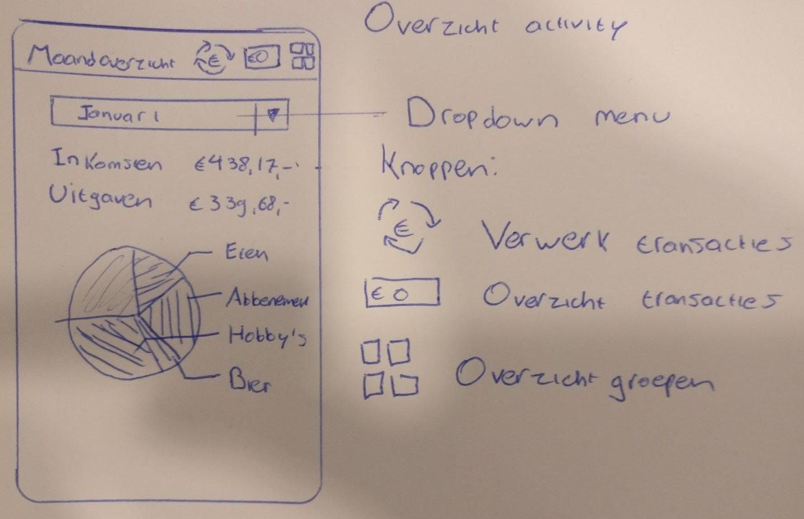
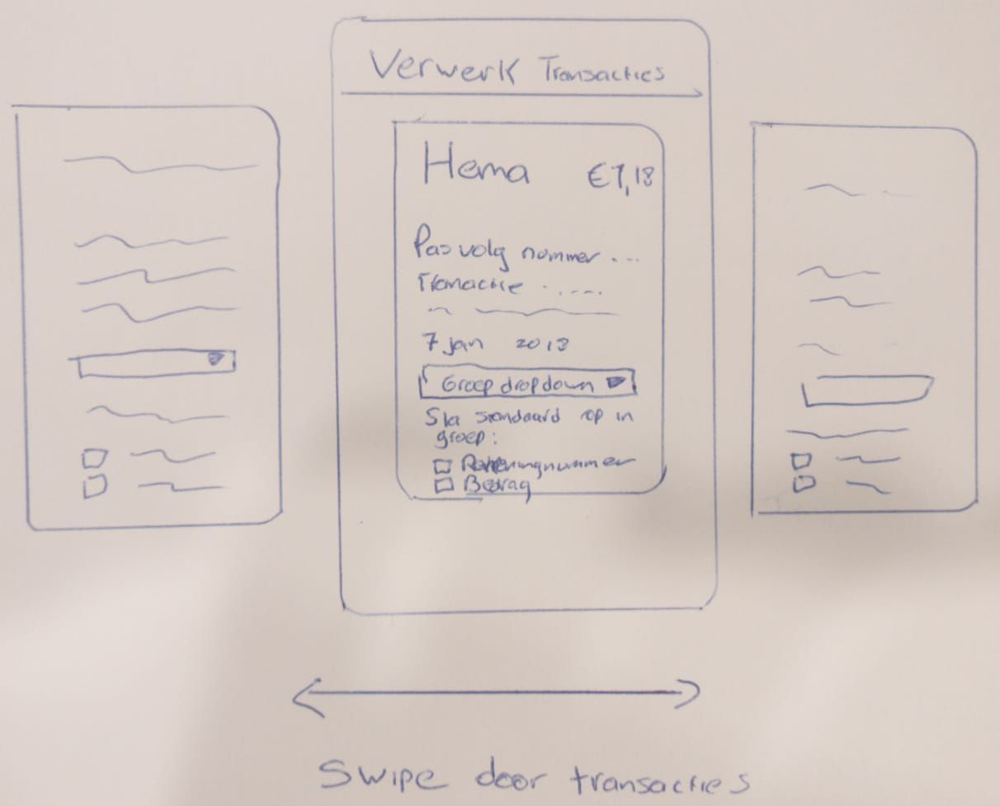
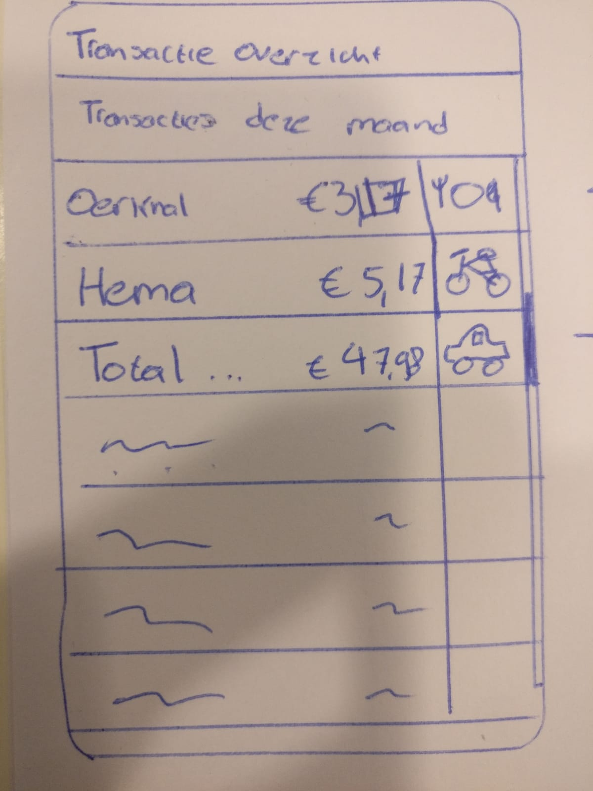
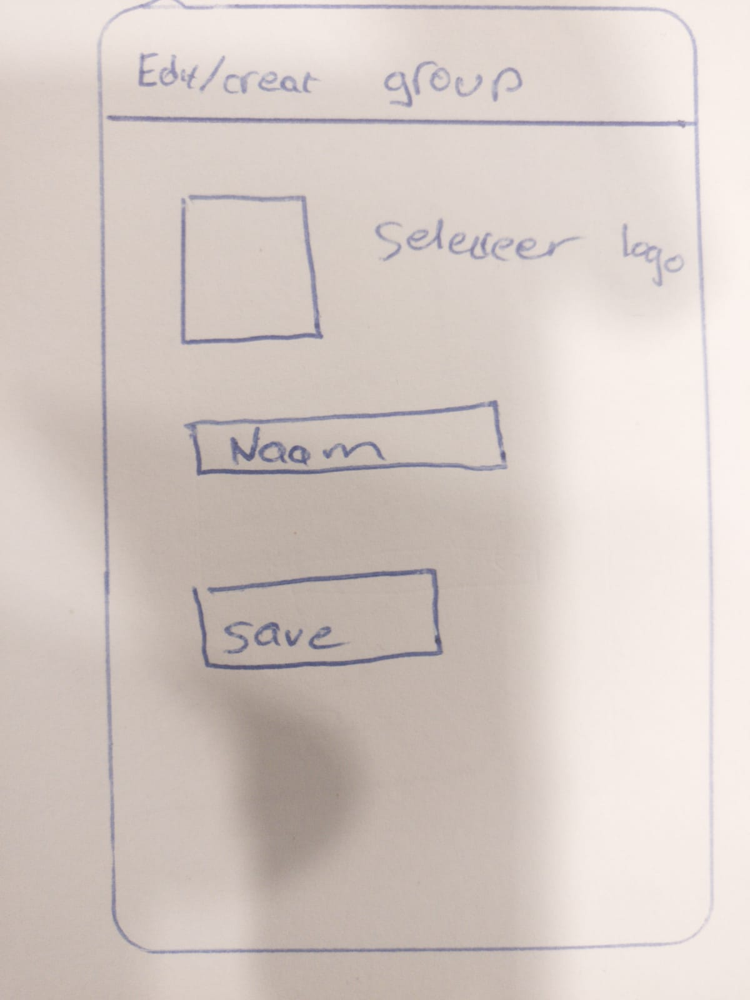

# Programmeer-project

## Problem statement:

A lot of people have troubles managing their money, they spend too much on certain things. As a result, they don't have enough money left at the end of the month or they are saving less then they would like to. With all the daily transactions, it can be really hard to keep an overview

## Solution

This app helps you to visualise your spendings and earnings in a easy way. Unlike other apps, who rely on entering your transactions manually, it'll imports your transactions without any hassle. This is possible due the new PDS2 api, which allows you to give us permission to your transactions. We only download your transactions with your permission! We can't make any payments and you data will only be stored on your device. 

You can divide every transactions into a category and then view how much you've spent each month on each category

## Main features

## Activities:

### Overview acticity

In the overview activity you can see how much you've spent and how much you've earned. The top bar consists of the app title and 3 buttons to navigate to other activities. The first button is the 'process transactions' button. The second button gives you an overview of all your transactions, and the third button gives you an overview of all your created groups.

### Process transactions activity

This activity allows you to divide your transactions into categories. You can swipe trough every transaction and select a suitable category. 
[optional feature] If I've enough time, I'll implement a feature that automatically selects a category if the transaction account number and/or amount matches another transaction. Any Chart for android

### Transaction overview activity

There will also be a general overview of all your transactions. This listviews contains all the transactions that are already in a category. 

### Group overview activity

This activity allows you to create new categories and delete them. Press a category to edit/ or create one

### Create/edit category

This activity allows you to edit a category or create a new one.

## Prerequisites

### External sources

The apps downloads your transactions from the ing api. First it authencates the application by retrieving an aplication access code. Then it authenticates the user by retreiving a user acces token. With the user access token we can download the transactions.

### Libraries

The app uses Any Chart for android to create a pie chart. 

### Similar apps

Similar apps don't have the same kind of interface, because they also have a lot more functions. This apps tends to give you insight in your spendings in the most easy way, without too many functions and or options: just a simple overview. They also don't download your transactions automatically, because the PSD2 api is only released in 2019.

### Hardest part

The hardest part will be connection with the ING API. The api itself is well documented but still a bit unclear. The connections uses own created RSA certificates, signatures and SHA hashes. 

