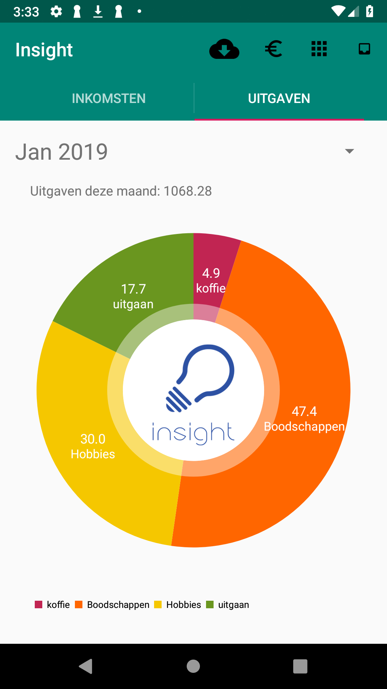

# Insight

Insight is an app that visualises all your transactions. It generates a pie chart for all your income and one for all your spent money. 

## How does it work?

### Download transactions

Go to your online banking account and generate a csv file. Download this file to your phone

### Create categories

Press the category button and create as many categories as you like. Select if you want to allow to cateorise income, spending, or both under this category. Don't forget to choose an appropiate icon!

### Categorise transactions

Now press the process transactions button. Now you'll see your inbox with all the uncategorised transactions. Choose one of the created categories and swipe left to continue to the next transaction. 

That's all! Go back to the main screen to analyse your financials. Made a mistake? No problem, go the the transaction overview and fix your mistake!

# credits

Category icons from freepik from flaticon.com

Demo video: https://youtu.be/Dr4CpIBgJKQ
