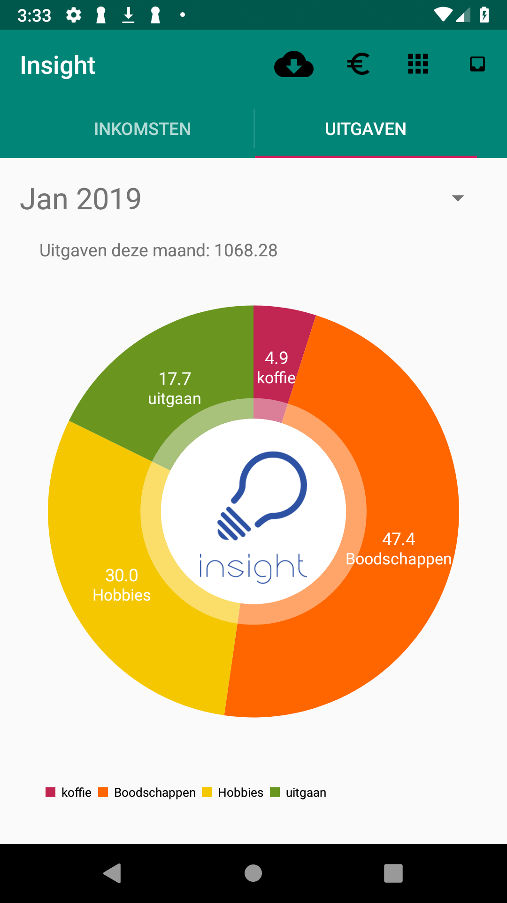

# Final report

## What is Insight?

Insight in an application that helps you managing your financial life. Import all your transactions through a csv file and it visualises all your income and spent money.
You can categorise every transaction and it generates a pie chart:

## Design overview

Let's start by discussing the general object and helpers that are used by almost every activity:

### The transaction Object

I've implemented the transaction almost as proposed, but with a few changes. The initial plan was to store the transaction type (atm withdrawal, pin transaction, sepa. etc) but i've decided against this. The transaction type is alsways clear from the title and it would've been useless extra information.
I forgot to write the category variable in the design document, but it was always part of the initial plan. However instead of linking to the id integer, i've decided to link to the category object itself. The last change is an extra boolean to indicate that the amount is negative. This is easier for the UI because we don't have to remove the minus sign every time.
<table>
<tr><th>proposed object</th><th> final object </th></tr>
<tr><td>Date date   String name   AccountType type   String IBAN double amount</td>
<td>int ID  Date date   String IBAN   String name   String description   double amount   CategoryObject cat   boolean negative</td></tr>
<tr><td> getDate()   getName()   getType()   getIBAN()   getAmount() </td>
<td>getDate()   getName()   getType()   getIban()   getCategory()   isNegative()   setCategory</td></tr>
</table>

### The category object

The category object was not in the design proposal, but it was one of the first things i've implemented. Nothing special, it just stores some variables and has no special function.
the biggest change in this object are the income and spending booleans. The dedicate if the user can categorise income, spending or both under this category. More information REFERRAL

<table>
<tr><th>Category object</th></tr>
<tr><td>int id   String name   Icon icon   boolean income   boolean spending</td></tr>
<tr><td>getName()   getIcon   getResourceID()   getID()   isIncome()   isSpending() </td> </tr>
</table>

### The period object

A complety new object. I wanted to let te user select custom periods but I did not think about how I wanted to do this. That's why I've created a new object. This object contains three vars, a start date, an end date and a format string. Pretty simple, but it does its job.
It has two contructors, one for a custom period and one that uses a month as length.

<table>
<tr><th>Period object</th></tr>
<tr><td>Date start   Date end   String format </td></tr>
<tr><td>getStart()   getEnd()   getString  </td></tr>
</table>

### The icon Enum

The last object, during programming i've found that linking to resource id became confusing as I added more icons. That's why i've created a enumeration. Is has a function getResourceId() that returns the corresponding resource of the selected Icon.
<table><tr><th>Icon enum</th></tr><tr><td>none</td></tr><tr><td>GetResourceId()</td></tr></table>

## The activities

### Insight
The main activity is InsightActivity.java. It inflates the toolbar menu and it's listeners, initialises the viewpager and the datespinner.
The datespinner has it's own adapter class. It was possible to use an default arrayAdapter for this, but it was cleaner to create a custom adapter as  the getSelectedItem functions now returns an PeriodObject. The adapter is called DateSpinnerAdapter.java
The Viewpager also has it's own class: InsightTab.java. It has two inner classes, one curstom FragmentPagerAdapter and a Fragment class. The fragment class sets up the UI and loads the piechart. To do this, it calls StatisticsHelper.java . The statistics helper gathers all the data and transforms it into usable piechart data.

All of the buttons in the toolbar start the corresponding activity, with an exception of the Download transactions button. This buttons opens the android file selector dialog. When a file is selected, it triggers the callback in InsightActivity.java. The callback calls a new class to handle the given data: CSVReader. CSVReader has two inner classes, the reader and the Callback interface.
This interface ensures that all the error's are handled properly. If no errors have occured, then CSVReader.java will call SQLManage.java to store the new transactions in the database.

### Manage categories activity

A pretty simple activity. It only contains a gridview. It calls CategoryAdapter.java to initialise the gridview. It also creates a new button to create a new cagtegory. When clicked the user is redirected to the NewCategory Activity. When the user clicks on a category it is redirected to Category ViewActivity.

### New category activity

Creates a new category. When the user presses the store button, it calss SQLManager.jave to create a new category.

### Category view activity

Shows the user the selected category. It contains an imageview, to textviews and a listview. It calls StatisticsHelper.java to get the sum of all the transactions and TransactionListAdadapter.java to initialise the list.

### Transaction overview Acitivty

Generated a list with all the transactions. It only containts a listview. It calls TransactionListAdapter.java to initialise the lsit. When the user clicks on a list item, it is redirected to the transaction view activity

### Transaction view activity

Gives the user information about a single transaction. It has two textviews to display the name and the description. It also has a spiner to change the corresponding category. The spinner calls the CategoryAdapter.java

### Process transactions activity

# spending and income
